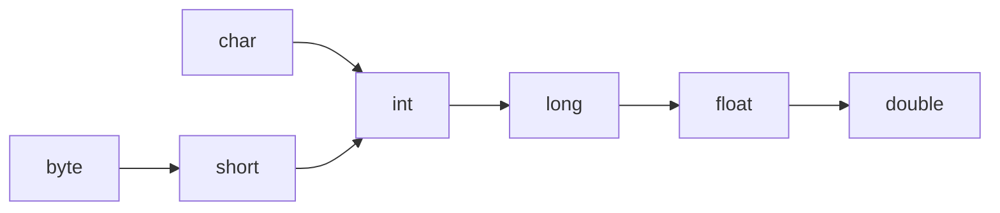

先来一张思维导图


<!-- more -->

## 基本数据类型

 | 数据据类型（名称） | 大小/（字节-位） | 封装类    | 默认值 | 可表示数据范围       |
 | ------------------ | ---------------- | --------- | ------ | -------------------- |
 | byte               | 1Byte = 8bit     | Byte      | 0      | -128~127             |
 | short              | 2Byte = 16bit    | Short     | 0      | -32768~32767         |
 | int                | 4Byte = 32bit    | Integer   | 0      | (-2^31^)~(2^31^ - 1) |
 | long               | 8Byte = 64bit    | Long      | 0L     | (-2^63^)~(2^63 -1)   |
 | float              | 4Byte = 32bit    | Float     | 0.0F   |                      |
 | double             | 8Byte = 64bit    | Double    | 0.0D   |                      |
 | char               | 2Byte = 16bit    | Character | \u0000 | 0~65535              |
 | boolean            | 1Byte = 8bit     | Boolean   | flase  | ~                    |

### 基本类型的转换

#### 自动类型转换

示意图：
> 箭头左边的数值类型可以自动类型转换成箭头右边的数值类型。


基本类型和字符串之间的转换

```java
public class Main {
    public static void main(String[] args) {
        // 基本类型和字符串进行连接是，基本类型自动转换成字符串
        String str = 3.6f + ""; 
        System.out.println(str); // 输出3.6
        System.out.println(1 + 2 + "World"); // 输出3World
        System.out.println("World" + 1 + 2); // 输出World12
    }
}
```

#### 强制类型转换

```java
public class Main {
    public static void main(String[] args) {
        double num1=33.6;
        int num2= (int) num1;
        double num3 = (double) num2;
        System.out.println(num1); // 33.6
        System.out.println(num2); // 33
        System.out.println(num3); // 33.0
    }
}
```

#### 隐式类型转换
```java
short s = 1;
// short s = s + 1;
```
因为 1 是 int 类型，比 short 类型精度高，不能隐式的将 int 类型转换成 short 类型。

但是有一点例外，就是进行自增自减赋值运算时，可以执行隐式的类型转换：
```java
short s = 1;
s += 1;
```

### 包装类型
基本类型都有对应的包装类型，基本类型与其对应的包装类型之间的赋值使用自动装箱与拆箱完成。

```java
Integer x = 2;     // 装箱
int y = x;         // 拆箱
```

## 引用数据类型

Java 中的引用数据类型可以说是变量指向了一个对象，也就是指向了对象的地址。

### 数组

创建数组
```java
// 创建数组大小为10的数组，默认值为0
int[] nums = new int[10];
// 创建时赋值
int[] nums = new int[]{1, 2, 3};
int[] nums = {1, 2, 3};
```

数组默认值
   - 整型(byte, short, int, long) ==> 0 
   - 浮点型(float, double) ==> 0.0
   - 字符型(char) ==> '\u0000'
   - 布尔型(boolean) ==> false
   - 引用类型(类、接口、数组) ==> null
